**In this article**
   * [What is MDM and why Intune?](#what-is-mdm-and-why-intune)
   * [How to develop an MAUI/Xamarin app with MDM support (including Intune example)](#how-to-develop-an-mauixamarin-app-with-mdm-support-including-intune-example)
   * [Implementation](#implementation)
      * [Android](#android)
      * [iOS](#ios)
      * [UWP](#uwp)
   * [Testing](#testing)
      * [Android](#android-1)
      * [iOS](#ios-1)
      * [UWP](#uwp-1)
   * [Intune](#intune)
      * [Android](#android-2)
      * [iOS](#ios-2)
      * [UWP](#uwp-2)
   * [End Devices Enrollment](#end-devices-enrollment)

What is MDM and why Intune?
=====
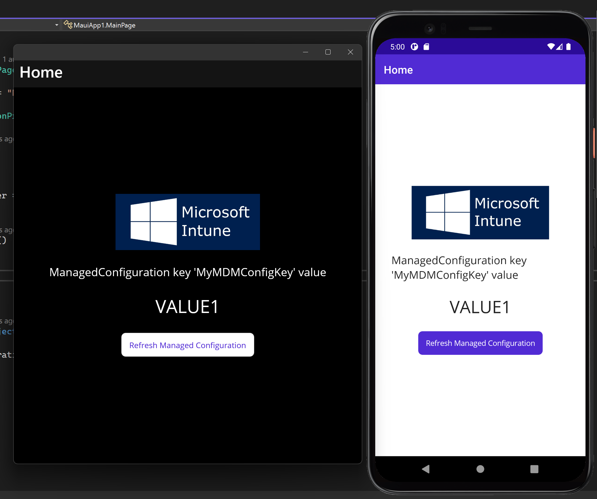
Mobile device management involves administering a large fleet of mobile devices, including smartphones, tablet computers, and laptops. You can deliver settings, apps, and certificates to end devices with MDM. There are various types of MDM solutions available, but I opted for Microsoft Intune as part of the Microsoft tech stack, which should be familiar to .NET developers and Azure IT experts. Additionally, it offers a trial period for us to test our app. It's worth noting that our current approach is compatible with any third-party MDM solution, such as SOTI, Citrix, Blackberry, and more.

Let's start right away with the source code for the demo app. You can find it through the following [link](https://github.com/JTOne123/XAM-MDM).

How to develop an MAUI/Xamarin app with MDM support (including Intune example)
====
The primary purpose of MDM support is to deliver configurations to the app, known as Managed configuration. Each platform has a slightly different approach for obtaining data from MDM and testing it. We use MAUI as a basic implementation, but on Xamarin Forms, everything works similarly. This concept also applies to all native apps, so you can explore it even if you are unfamiliar with Xamarin or MAUI.

Implementation
====
Let's review the basic implementation. I've divided the implementation into several files and placed them on each platform. Hopefully, this will make it easier to copy the code to older Xamarin projects. While you can specify many managed configurations, for simplicity's sake, I've only created one. Here's a shared manager class that allows us to read the managed configuration by its key.
https://github.com/JTOne123/XAM-MDM/blob/b815a7c5f51dd8a9f811c40093df25f95665603c/XAM-MDM/MauiApp1/ManagedConfigurationProvider.cs#L1-L7


## Android
The foundation of the Android implementation is the [RestrictionsManager](https://developer.android.com/work/managed-configurations). To begin, we must define our app's remote configuration options by including the next element in our manifest's &lt;application&gt; element.
https://github.com/JTOne123/XAM-MDM/blob/b815a7c5f51dd8a9f811c40093df25f95665603c/XAM-MDM/MauiApp1/Platforms/Android/AndroidManifest.xml#L1-L8
 
Then describe the main details of the restriction.
https://github.com/JTOne123/XAM-MDM/blob/b815a7c5f51dd8a9f811c40093df25f95665603c/XAM-MDM/MauiApp1/Platforms/Android/Resources/xml/app_restrictions.xml#L1-L8

Next, retrieve the system service and read a value from the bundle.
https://github.com/JTOne123/XAM-MDM/blob/b815a7c5f51dd8a9f811c40093df25f95665603c/XAM-MDM/MauiApp1/Platforms/Android/ManagedConfigurationProvider.cs#L1-L23

For more information, please refer to the following [link](https://developer.android.com/work/managed-configurations).

## iOS
For iOS, the process is much simpler: we need to retrieve a specific dictionary from the user preferences. That's all there is to it.
https://github.com/JTOne123/XAM-MDM/blob/b815a7c5f51dd8a9f811c40093df25f95665603c/XAM-MDM/MauiApp1/Platforms/iOS/ManagedConfigurationProvider.cs#L1-L22

For more information, please see the following [link](https://developer.apple.com/documentation/devicemanagement).

## UWP
The same applies to UWP as well.
https://github.com/JTOne123/XAM-MDM/blob/b815a7c5f51dd8a9f811c40093df25f95665603c/XAM-MDM/MauiApp1/Platforms/Windows/ManagedConfigurationProvider.cs#L1-L22
 
To learn more, please refer to the following [link](https://learn.microsoft.com/en-us/windows/client-management/mdm/enterprisemodernappmanagement-csp).

Testing
=====
This section will discuss how to test our code locally without publishing the app to app stores. Although the implementations are simple, testing is crucial to ensure the quality of the code. Let's take a look at the available options for testing.

## Android
To test the Android app locally, Google [recommends](https://source.android.com/docs/devices/admin/testing-setup?hl=en) using their [TestDPC app](https://play.google.com/store/apps/details?id=com.afwsamples.testdpc&hl=en). To begin, install the app and enroll the device. Then select your app and apply managed settings.

## iOS
For iOS, you can easily set user preferences using the xcrun command in your terminal and test it with a simulator. Use the following commands to set or remove preferences:

*To set*
```
xcrun simctl spawn booted defaults write com.pavlodatsiuk.xammdm com.apple.configuration.managed -dict 'key1' 'VALUE1'
```
*To remove*
```
xcrun simctl spawn booted defaults delete com.pavlodatsiuk.xammdm
```

## UWP
Unfortunately, there is no straightforward approach for delivering settings locally for UWP. However, you can build a local package and deliver it with Intune along with its settings. Let's move on to the next section of this article.

Intune
====
Let's log in to our Intune portal using the following [link](https://endpoint.microsoft.com/#home). Please note that you must have an Azure AD Premium P2 license or trial, and you can obtain a free trial on the [Azure portal](https://portal.azure.com/#view/Microsoft_AAD_IAM/LicensesMenuBlade/~/Overview).
I will explain how to install apps from app stores as the primary source. However, we will make an exception for Windows and test our implementation before releasing it. Generally, you must release your app on Google Play and the Apple App Store before proceeding here.

To configure everything for your apps, we will switch between two primary tabs on the left side of the Intune website: Apps and Devices.

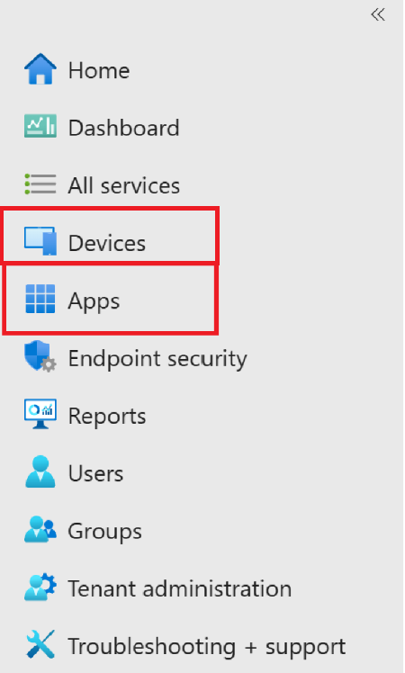
 
### The overall configuration requires three main steps:
1.	Add an app from the store.
2.	Select assignments for users.
3.	Set up managed configuration.

### Prerequisites
1.	[Microsoft Endpoint Manager admin center](https://endpoint.microsoft.com/#home)
2.	Azure AD Premium P2 license (or trial)
3.	[Azure Active Directory](https://portal.azure.com/#view/Microsoft_AAD_IAM/LicensesMenuBlade/~/Overview)

## Android
To add your app, go to the Apps section and select Android. Then, click on the Add button. Choose "Managed Google Play app" as the app type. 
You must log in to your Google Play account using your credentials, and you need to do this once.
After logging in, find your app in the window that appears. Click on the "Approve" button, followed by the "Sync" button.
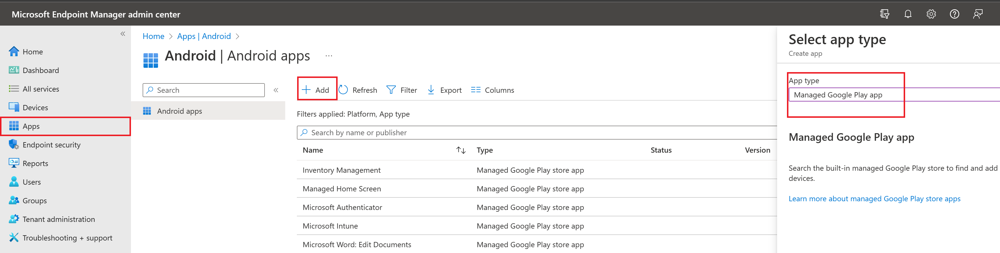

Once you have added your app, you must assign it to end users or end devices. For testing purposes, you can assign it to everyone.
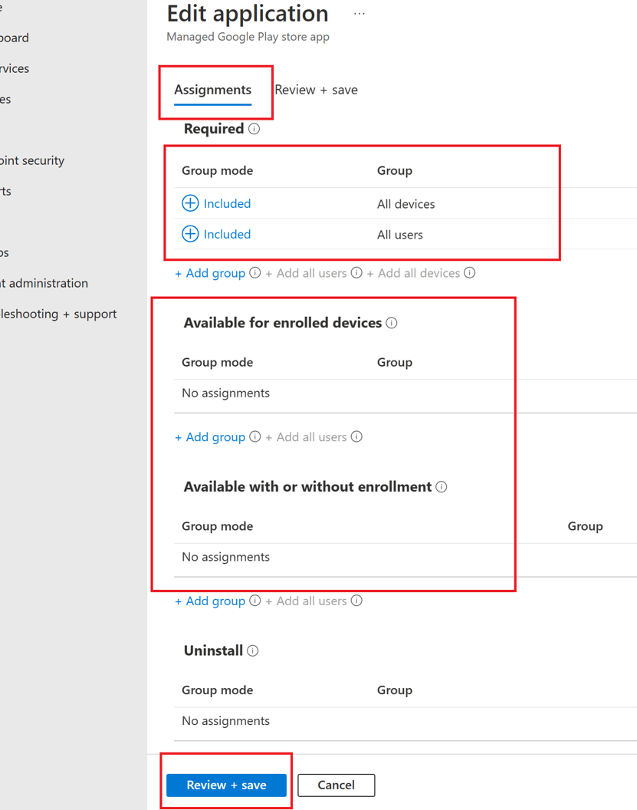

The final step is to configure your app's managed settings. Go to the Apps tab and select "App Configuration policies" followed by "Managed devices".
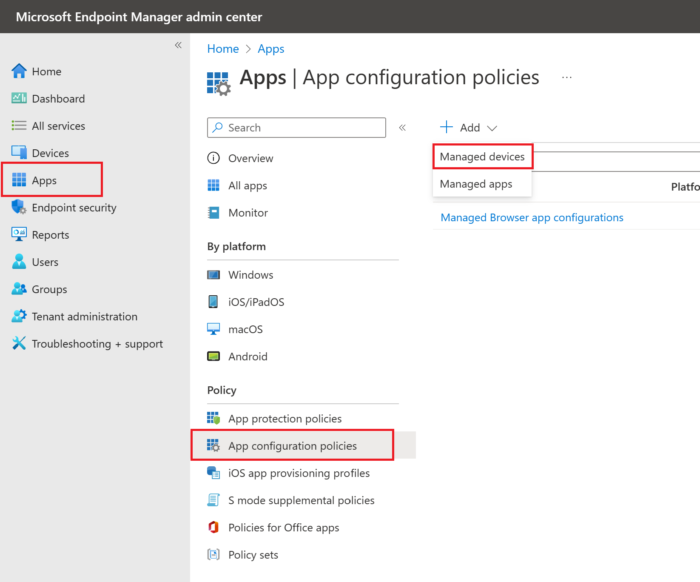
 
Then select the platform, profile, and the app itself. In our case, it should be Android Enterprise or iOS/iPadOS for iOS.
We must select your managed configuration and permission if required on the next screen.
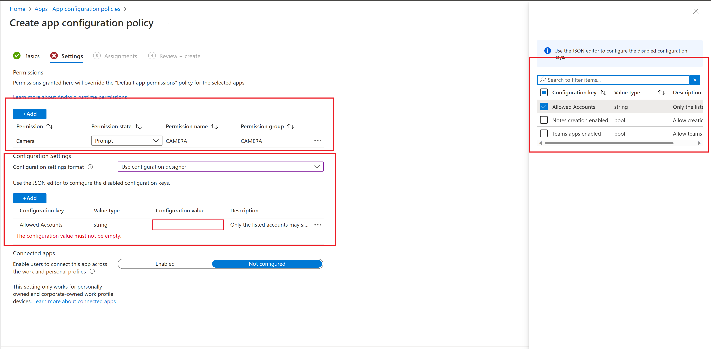

That's it! You need to wait for the changes to take effect. If you want to speed up the process, you can force the changes by clicking on the "Sync" button under Devices -> Android -> Android devices -> Your devices.

## iOS
The configuration process for the iOS app is nearly identical to that of the Android. Please refer to the Android section above for guidance. The only difference lies in adding the Apple MDM Push certificate under the Devices tab.
To upload the certificate, simply follow the instructions provided on the Apple Push Certificates Portal webpage. Additional information can be found at the following [link](https://learn.microsoft.com/en-us/mem/intune/enrollment/apple-mdm-push-certificate-get).
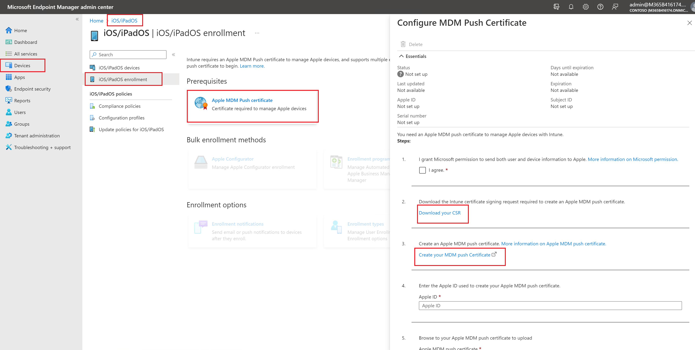 
Once the MDM push certificate has been added, return to the Apps tab, and proceed with the app configuration process. To add a new app, click on the Add button located in the Apps -> iOS store app, and follow the same steps as for Android.

## UWP
There are a few points regarding the UWP app that I would like to highlight:
1.	[We intend to distribute the app package for testing purposes.](#the-local-app-package-for-testing)
2.	[The app can also be installed from the Microsoft Store, like how it was set up for Android and iOS.](#from-microsoft-store)
3.	[The process for configuring managed settings is notably different.](#managed-configuration)

### The local app package for testing
To deliver an app packaged in an msixbundle, please follow these steps:
1.	Go to the "Apps" tab.
2.	Click the "Add" button.
3.	Select "Other/Line-of-business app."
4.	Upload the app package.
5.	Sync the device.

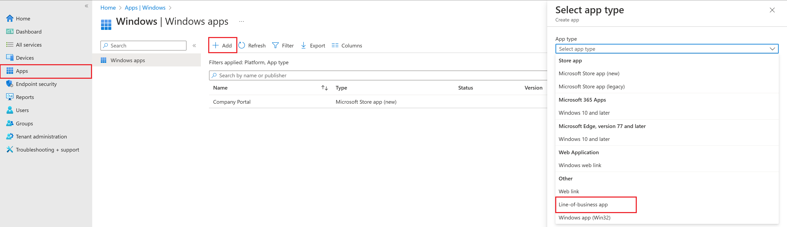 

Please be aware that the installation process may fail if you have not installed a test certificate that is automatically included in the app package. To avoid this issue, install the certificate in the Trusted People certificate store. For more information, please refer to the [link](https://learn.microsoft.com/en-us/appcenter/distribution/installation) provided. You can either manually install the certificate or deliver the root certificate with Intune to the end device.

### From Microsoft Store
Another option for setting up Windows apps is similar to Android, which involves selecting an app from the Microsoft Store. To do this, go to the "Apps" tab and click the "Add" button. Then, select the "Microsoft Store app (new)" option and choose the desired app.

When configuring the app, make sure to specify assignments to user groups or devices, as it is a required step. So, don't forget to complete this step.

### Managed configuration
As mentioned, delivering managed configuration to the Windows app requires a slightly different approach. 
To deliver managed configuration for Windows apps, you must follow a slightly different approach. First, go to the "Devices" section and select "Windows" to view your Windows devices. Then, move to the "Configuration Profiles" section and create the "Custom" profile using templates for the Windows 10 platform. 
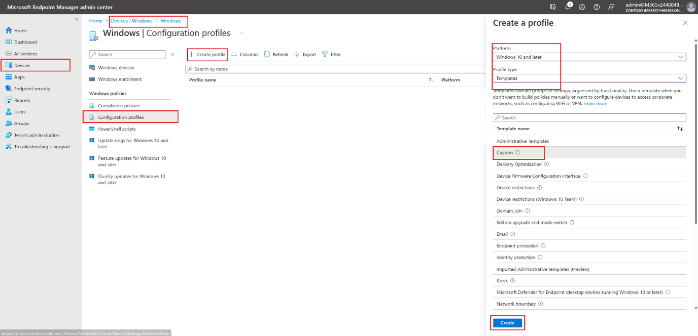 

Define a name for the profile and click "Next".
In the "Configuration settings" step, add a new OMA-URI setting and fill in all necessary fields. Enter **./User/Vendor/MSFT/EnterpriseModernAppManagement/AppManagement/AppStore/*maui-package-name-placeholder_9zz4h110yvjzm*/AppSettingPolicy/*MyMDMConfigKey*** in the OMA-URI field, where ***maui-package-name-placeholder_9zz4h110yvjzm*** refers to the package family name and ***MyMDMConfigKey*** is the managed configuration name defined in your code. 
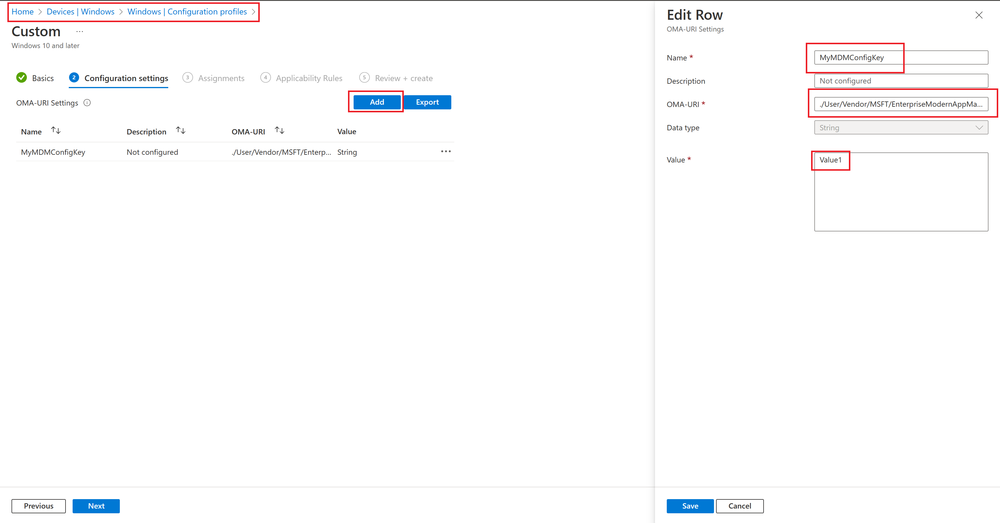 
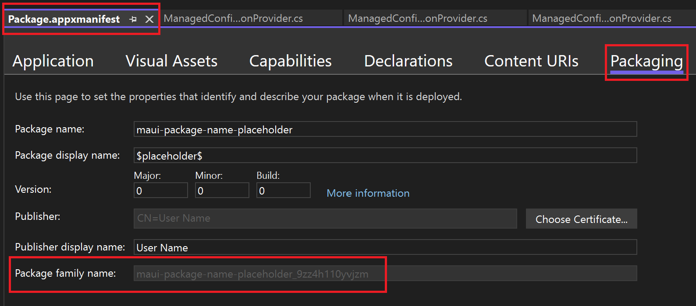 

Finally, proceed to the subsequent steps and assign the relevant user groups. Sync your device and wait for the delivery of the configuration.

End Devices Enrollment
=====
First, you must enroll your end devices by installing the [Intune Company Portal app](https://learn.microsoft.com/en-us/mem/intune/user-help/sign-in-to-the-company-portal) and logging in to your account. This account consists of a list of users defined in your AAD. All other configurations for your end devices can be completed through the Intune website.

In conclusion, I hope this article has provided more clarity than confusion. 
Please follow me for exciting future reads.

<a href="https://www.buymeacoffee.com/pauldatsiuk" target="_blank"></a>